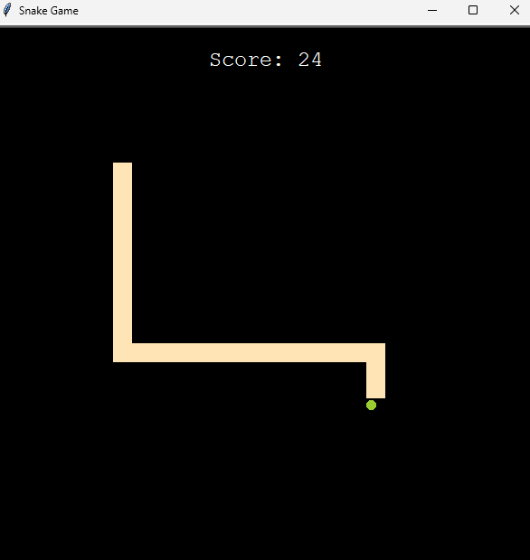
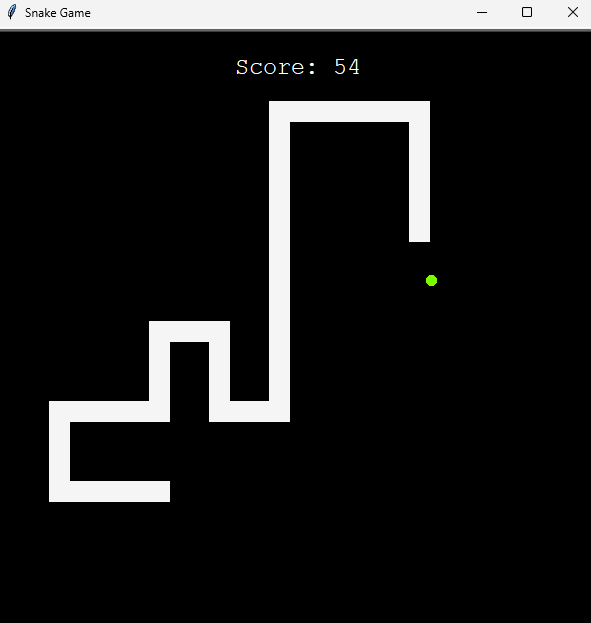
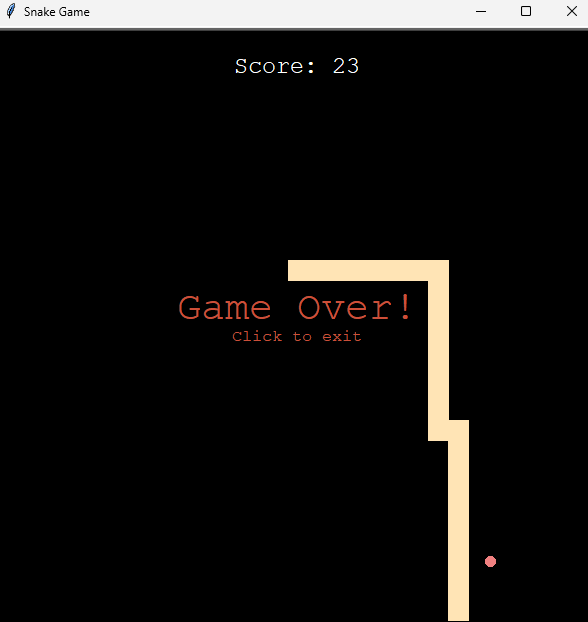
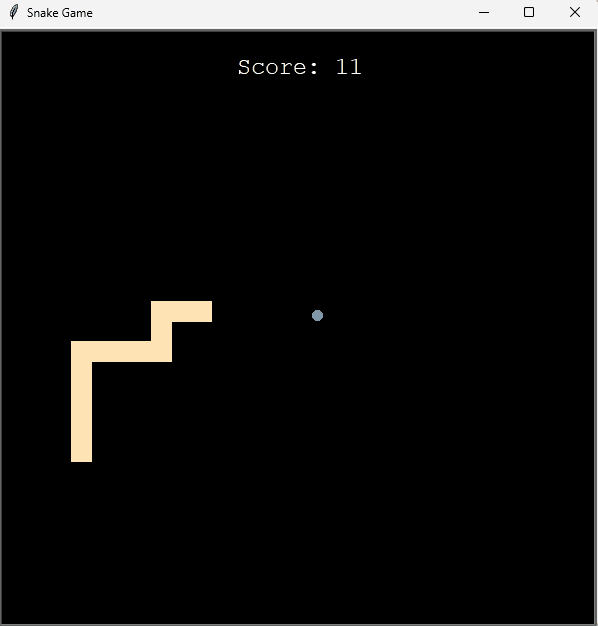

# snake-game
 ### A basic but fully functional snake game
 
 This is a game I designed while learning how to code in Python. Although fairly simple, I made sure to make the game feel complete and polished.
 
 Uses [Turtle Graphics](https://docs.python.org/3/library/turtle.html#module-turtle) as the base for the GUI.
 <br>
 Uses [winsound](https://docs.python.org/3/library/winsound.html?highlight=winsound#module-winsound) for processing the game audio.

### How to Play the Game:
1. Download the repository
2. Extract the files
3. Open command shell at the location.
4. Run 'main.py' in the cmd using: <br>

```python
python main.py
```
 ### In Game Images:
 | Start Game: | Mid Game: |
 | ----------- | --------- |
 |  |  |

| End Game: | Game Over: |
| --------- | ---------- |
|  |  |

### In Game Video:


### Credits:
* Score sound: [FreeSound.org](https://freesound.org/people/MATRIXXX_/sounds/443258/)
* Game Over sound: [FreeSound.org](https://freesound.org/people/EVRetro/sounds/533034/)
